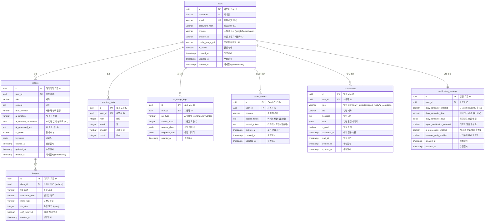
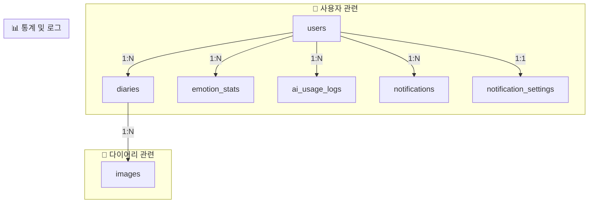
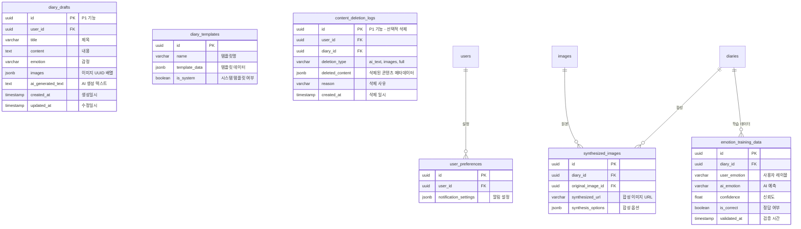

# 감성 AI 다이어리 '새김' - Entity Relationship Diagram (ERD)

---

## 1. 문서 개요

### 문서 목적

본 문서는 '새김' 서비스의 데이터베이스 구조를 시각적으로 표현한 ERD(Entity Relationship Diagram)를 제공합니다. PRD, TRD, PERSONA, FLOW_CHART 문서를 기반으로 도출된 데이터 모델을 정의합니다.

### 문서 정보

- **작성일**: 2025년 8월 9일
- **버전**: 1.2
- **최종 수정일**: 2025년 8월 9일
- **작성자**: 새김꾼들
- **관련 문서**: PRD.md, TRD.md, PERSONA.md, FLOW_CHART.md
- **변경 이력**:
  - v1.1: 감정 필드 분리 (user_emotion, ai_emotion, ai_emotion_confidence)
  - v1.2: 소셜 로그인 전용 시스템으로 변경 (password_hash 제거, provider/provider_id/email_hash 추가)
  - v1.3: email 암호화 제거

---

## 2. ERD 다이어그램

### 2.1 전체 ERD



### 2.2 관계 상세 설명



---

## 3. 엔티티 상세 정의

### 3.1 users (사용자)

| 컬럼명            | 데이터 타입  | 제약조건      | 설명                             |
| ----------------- | ------------ | ------------- | -------------------------------- |
| id                | UUID         | PK            | 사용자 고유 식별자               |
| nickname          | VARCHAR(50)  | NOT NULL      | 사용자 닉네임                    |
| email             | VARCHAR(255) | NOT NULL      | 이메일(아이디)             |
| password_hash             | VARCHAR(255) | NULL      | 비밀번호 해시             |
| provider          | VARCHAR(20)  | NOT NULL      | 소셜 제공자 (google/kakao/naver) |
| provider_id       | VARCHAR(255) | NOT NULL      | 소셜 제공자의 사용자 ID          |
| profile_image_url | VARCHAR(500) | NULL          | 프로필 이미지 URL                |
| is_active         | BOOLEAN      | DEFAULT true  | 계정 활성 상태                   |
| created_at        | TIMESTAMP    | DEFAULT NOW() | 가입일시                         |
| updated_at        | TIMESTAMP    | DEFAULT NOW() | 정보 수정일시                    |
| deleted_at        | TIMESTAMP    | NULL          | Soft Delete 일시                 |

**인덱스:**

- UNIQUE INDEX `idx_provider_provider_id` (provider, provider_id)
- UNIQUE INDEX `idx_email` (email)

### 3.2 diaries (다이어리)

| 컬럼명                | 데이터 타입  | 제약조건      | 설명                          |
| --------------------- | ------------ | ------------- | ----------------------------- |
| id                    | UUID         | PK            | 다이어리 고유 식별자          |
| user_id               | UUID         | FK, NOT NULL  | 작성자 ID                     |
| title                 | VARCHAR(255) | NULL          | 다이어리 제목                 |
| content               | TEXT         | NOT NULL          | 다이어리 내용                 |
| user_emotion          | VARCHAR(20)  | NULL          | 사용자 선택 감정 (5가지)      |
| ai_emotion            | VARCHAR(20)  | NULL          | AI 분석 감정 (5가지)          |
| ai_emotion_confidence | FLOAT        | NULL          | AI 감정 분석 신뢰도 (0.0-1.0) |
| ai_generated_text     | TEXT         | NULL          | AI 생성 텍스트                |
| is_public             | BOOLEAN      | DEFAULT false | 공개 여부                     |
| keywords             | JSONB      | DEFAULT [] | 키워드                     |
| created_at            | TIMESTAMP    | DEFAULT NOW() | 작성일시                      |
| updated_at            | TIMESTAMP    | DEFAULT NOW() | 수정일시                      |
| deleted_at            | TIMESTAMP    | NULL          | Soft Delete 일시              |

**인덱스**:

- `idx_user_created (user_id, created_at DESC)`
- `idx_emotion_analysis (user_emotion, ai_emotion)` - 감정 일치도 분석용

### 3.3 images (이미지)

| 컬럼명         | 데이터 타입  | 제약조건      | 설명               |
| -------------- | ------------ | ------------- | ------------------ |
| id             | UUID         | PK            | 이미지 고유 식별자 |
| diary_id       | UUID         | FK, NULL      | 다이어리 ID        |
| file_path      | VARCHAR(500) | NOT NULL      | MinIO 파일 경로    |
| thumbnail_path | VARCHAR(500) | NULL          | 썸네일 경로        |
| mime_type      | VARCHAR(50)  | NULL          | MIME 타입          |
| file_size      | INTEGER      | NULL          | 파일 크기 (bytes)  |
| exif_removed   | BOOLEAN      | DEFAULT true  | EXIF 제거 여부     |
| created_at     | TIMESTAMP    | DEFAULT NOW() | 업로드일시         |

**인덱스**: `idx_diary_images (diary_id)`

**제약사항**:

- 다이어리당 최대 10개 이미지 파일 허용
- 파일당 최대 15MB 크기 제한
- 총 업로드 크기 120MB 제한
- 지원 형식: JPEG, PNG, WebP
- Rate Limiting: 사용자당 시간당 60회 업로드 허용

### 3.4 emotion_stats (감정 통계)

| 컬럼명  | 데이터 타입 | 제약조건     | 설명             |
| ------- | ----------- | ------------ | ---------------- |
| id      | UUID        | PK           | 통계 고유 식별자 |
| user_id | UUID        | FK, NOT NULL | 사용자 ID        |
| year    | INTEGER     | NOT NULL     | 년도             |
| month   | INTEGER     | NOT NULL     | 월               |
| emotion | VARCHAR(20) | NOT NULL     | 감정 타입        |
| count   | INTEGER     | DEFAULT 0    | 횟수             |

**인덱스**: `unique_user_period_emotion (user_id, year, month, emotion)`

### 3.5 ai_usage_logs (AI 사용 로그)

| 컬럼명        | 데이터 타입 | 제약조건      | 설명             |
| ------------- | ----------- | ------------- | ---------------- |
| id            | UUID        | PK            | 로그 고유 식별자 |
| user_id       | UUID        | FK, NOT NULL  | 사용자 ID        |
| api_type      | VARCHAR(50) | NOT NULL      | API 타입         |
| tokens_used   | INTEGER     | NULL          | 사용 토큰 수     |
| request_data  | JSONB       | NULL          | 요청 데이터      |
| response_data | JSONB       | NULL          | 응답 데이터      |
| created_at    | TIMESTAMP   | DEFAULT NOW() | 호출일시         |

**인덱스**: `idx_user_created (user_id, created_at DESC)`

### 3.6 oauth_tokens (OAuth 토큰)

| 컬럼명        | 데이터 타입 | 제약조건      | 설명                   |
| ------------- | ----------- | ------------- | ---------------------- |
| id            | UUID        | PK            | 토큰 고유 식별자       |
| user_id       | UUID        | FK, NOT NULL  | 사용자 ID              |
| provider      | VARCHAR(20) | NOT NULL      | 소셜 제공자            |
| access_token  | TEXT        | NOT NULL      | 액세스 토큰 (암호화)   |
| refresh_token | TEXT        | NULL          | 리프레시 토큰 (암호화) |
| expires_at    | TIMESTAMP   | NULL          | 토큰 만료 시간         |
| created_at    | TIMESTAMP   | DEFAULT NOW() | 생성일시               |
| updated_at    | TIMESTAMP   | DEFAULT NOW() | 수정일시               |

**인덱스**:

- UNIQUE INDEX `idx_user_provider` (user_id, provider)

### 3.7 notifications (알림)

| 컴럼명        | 데이터 타입 | 제약조건      | 설명                                                  |
| ------------- | ----------- | ------------- | --------------------------------------------------------- |
| id            | UUID        | PK            | 알림 고유 식별자                                         |
| user_id       | UUID        | FK, NOT NULL  | 사용자 ID                                                |
| type          | VARCHAR(50) | NOT NULL      | 알림 유형 (diary_reminder, report_ready, ai_complete) |
| title         | VARCHAR(255)| NOT NULL      | 알림 제목                                                |
| message       | TEXT        | NOT NULL      | 알림 내용                                                |
| data          | JSONB       | NULL          | 알림 관련 세부 데이터 (JSON)                        |
| is_read       | BOOLEAN     | DEFAULT false | 읽음 상태                                              |
| scheduled_at  | TIMESTAMP   | NULL          | 예약 전송 시간                                        |
| read_at       | TIMESTAMP   | NULL          | 읽음 시간                                              |
| created_at    | TIMESTAMP   | DEFAULT NOW() | 생성일시                                               |
| updated_at    | TIMESTAMP   | DEFAULT NOW() | 수정일시                                               |

**인덱스**:

- `idx_user_notifications (user_id, created_at DESC)`
- `idx_notification_type (type, scheduled_at)`
- `idx_unread_notifications (user_id, is_read, created_at DESC)` WHERE is_read = false

### 3.8 notification_settings (알림 설정)

| 컴럼명                      | 데이터 타입 | 제약조건      | 설명                                     |
| --------------------------- | ----------- | ------------- | -------------------------------------------- |
| id                          | UUID        | PK            | 설정 고유 식별자                           |
| user_id                     | UUID        | FK, NOT NULL  | 사용자 ID                                  |
| diary_reminder_enabled      | BOOLEAN     | DEFAULT true  | 다이어리 작성 리마인드 활성화               |
| diary_reminder_time         | VARCHAR(5)  | DEFAULT '21:00' | 리마인드 시간 (HH:MM 형식)               |
| diary_reminder_days         | JSONB       | DEFAULT '[]'  | 리마인드 요일 배열 ['mon','tue',...] |
| report_notification_enabled | BOOLEAN     | DEFAULT true  | 월간 리포트 알림 활성화                    |
| ai_processing_enabled       | BOOLEAN     | DEFAULT true  | AI 처리 완료 알림 활성화                  |
| browser_push_enabled        | BOOLEAN     | DEFAULT false | 브라우저 푸시 알림 활성화                |
| created_at                  | TIMESTAMP   | DEFAULT NOW() | 생성일시                                 |
| updated_at                  | TIMESTAMP   | DEFAULT NOW() | 수정일시                                 |

**인덱스**:

- UNIQUE INDEX `idx_user_notification_settings` (user_id)

---

## 4. 관계 정의

### 4.1 1:N 관계

| 부모 테이블 | 자식 테이블   | 관계 설명                                    | CASCADE 정책 |
| ----------- | ------------- | -------------------------------------------- | ------------ |
| users       | diaries       | 사용자는 여러 다이어리 작성 가능             | CASCADE     |
| users       | images        | 사용자는 여러 이미지 업로드 가능             | CASCADE     |
| users       | emotion_stats | 사용자별 월간 감정 통계                      | CASCADE      |
| users       | ai_usage_logs | 사용자별 AI 사용 기록                        | CASCADE      |
| users       | oauth_tokens  | 사용자별 OAuth 토큰                          | CASCADE      |
| users       | notifications | 사용자별 알림 및 알림 설정                | CASCADE      |
| users       | notification_settings | 사용자별 알림 설정 (1:1)            | CASCADE      |
| diaries     | images        | 다이어리당 최대 10개 파일 (각 15MB, 총 120MB) | SET NULL     |

### 4.2 관계 제약사항

1. **다이어리 삭제 시**

   - images: SET NULL (이미지는 유지, 연결만 해제)

<!-- MVP 이후 개발 예정 기능
2. 사용자 탈퇴 시 (소셜 로그인 환경)
   - 즉시 삭제 (기본값): 서비스 탈퇴 시 모든 새김 데이터 즉시 완전 삭제
   - 복구 옵션: 사용자 요청 시에만 30일간 복구 기간 제공 (Soft Delete)
   - 자동 Hard Delete: 복구 기간 설정 시 30일 후 자동 완전 삭제
   - 삭제 범위:
     - users 테이블: 사용자 정보 완전 삭제
     - diaries 테이블: CASCADE DELETE (모든 다이어리 삭제)
     - images 테이블: 파일 시스템에서 이미지 파일 삭제 후 메타데이터 삭제
     - emotion_stats 테이블: CASCADE DELETE (감정 통계 삭제)
     - ai_usage_logs 테이블: CASCADE DELETE (AI 사용 기록 삭제)
     - oauth_tokens 테이블: CASCADE DELETE (OAuth 토큰 삭제)
     - Redis 캐시: 사용자 관련 모든 캐시 삭제
-->

---

## 5. 데이터베이스 최적화 전략

### 5.1 인덱싱 전략

```sql
-- 자주 사용되는 쿼리 패턴에 대한 복합 인덱스
CREATE INDEX idx_user_created ON diaries(user_id, created_at DESC);
CREATE INDEX idx_diary_images ON images(diary_id);
CREATE INDEX idx_user_emotion_period ON emotion_stats(user_id, year, month);

-- 감정 분석 관련 인덱스
CREATE INDEX idx_emotion_analysis ON diaries(user_emotion, ai_emotion);
CREATE INDEX idx_ai_confidence ON diaries(ai_emotion_confidence) WHERE ai_emotion_confidence IS NOT NULL;
CREATE INDEX idx_emotion_mismatch ON diaries(user_id, created_at)
    WHERE user_emotion != ai_emotion AND ai_emotion IS NOT NULL;

-- 데이터 삭제 최적화 인덱스
CREATE INDEX idx_users_deleted_at ON users(deleted_at) WHERE deleted_at IS NOT NULL;
CREATE INDEX idx_diaries_deleted_at ON diaries(deleted_at) WHERE deleted_at IS NOT NULL;
CREATE INDEX idx_cleanup_expired_users ON users(deleted_at, id)
    WHERE deleted_at IS NOT NULL AND deleted_at <= CURRENT_TIMESTAMP - INTERVAL '30 days';
```

### 5.2 파티셔닝 전략 (향후 확장 시)

```sql
-- 월별 파티셔닝 예시 (대용량 데이터 처리 시)
CREATE TABLE diaries_2025_01 PARTITION OF diaries
    FOR VALUES FROM ('2025-01-01') TO ('2025-02-01');
```

### 5.3 캐싱 전략

- **Redis 캐싱 대상**:
  - 자주 조회되는 다이어리 목록 (10분 TTL)
  - 다이어리 상세 (30분 TTL)
  - AI 생성 결과 (1시간 TTL)
  - AI 키워드 추천 (30분 TTL)
  - 월간 감정 통계 (24시간 TTL)
  - 감정 리포트 (24시간 TTL)
  - 집계 결과 (1시간 TTL)
  - 이미지 메타데이터 (24시간 TTL)
  - 썸네일 (7일 TTL)
  - 합성 이미지 (1시간 TTL)

---

## 6. 보안 고려사항

### 6.1 데이터 암호화

#### 암호화 대상 컬럼

- **oauth_tokens 테이블**:

  - `access_token`: AES-256-GCM 암호화
  - `refresh_token`: AES-256-GCM 암호화

- **diaries 테이블**:

  - `content`: AES-256-GCM 암호화
  - `ai_generated_text`: AES-256-GCM 암호화

- **images 테이블**:
  - `file_path`: UUID 기반 난독화
  - 실제 파일: MinIO SSE-S3 암호화

#### 암호화 키 관리

- **키 저장 방식**:
  - 개발 환경: `.env` 파일의 환경 변수
  - 운영 환경: 서버 환경 변수 또는 Docker secrets

### 6.2 접근 제어

- Row-level Security (RLS) 적용
- user_id 기반 데이터 접근 제한
- API 레벨에서 추가 검증

---

## 7. 확장 가능한 스키마 설계

### 7.1 향후 추가 예정 테이블



### 7.2 스키마 버전 관리

- Alembic을 통한 마이그레이션 관리
- 각 변경사항에 대한 롤백 스크립트 준비
- 버전별 호환성 매트릭스 유지

---

## 8. 성능 목표 및 제약

### 8.1 쿼리 성능 목표

| 쿼리 유형          | 목표 응답시간 | 최대 허용시간 |
| ------------------ | ------------- | ------------- |
| 다이어리 목록 조회 | < 100ms       | 200ms         |
| 다이어리 상세 조회 | < 50ms        | 100ms         |
| 감정 통계 집계     | < 500ms       | 1000ms        |
| 키워드 검색        | < 200ms       | 500ms         |

### 8.2 데이터 용량 계획

| 엔티티   | 예상 레코드 수 (1년) | 평균 레코드 크기 | 총 용량 |
| -------- | -------------------- | ---------------- | ------- |
| users    | 100,000              | 500 bytes        | 50 MB   |
| diaries  | 3,650,000            | 2 KB             | 7.3 GB  |
| images   | 10,950,000           | 100 bytes (메타) | 1.1 GB  |

**총 예상 DB 용량**: ~10.3 GB (메타데이터만, 실제 이미지는 MinIO)

---

## 9. 모니터링 및 유지보수

### 9.1 모니터링 지표

- **성능 지표**:

  - 쿼리 응답 시간
  - 인덱스 사용률
  - 캐시 히트율

- **용량 지표**:
  - 테이블별 레코드 수
  - 스토리지 사용량
  - 인덱스 크기

### 9.2 정기 유지보수

- **일간**: VACUUM ANALYZE 실행
- **주간**: 인덱스 재구성
- **월간**: 파티션 관리, 통계 업데이트

---

## Appendix

### A. 감정 타입 정의

```typescript
enum EmotionType {
  HAPPY = 'happy', // 😊 행복
  SAD = 'sad', // 😢 슬픔
  ANGRY = 'angry', // 😡 화남
  PEACEFUL = 'peaceful', // 😌 평온
  WORRIED = 'worried', // 🫨 불안
}

// 감정 분석 결과 인터페이스
interface EmotionAnalysis {
  userEmotion: EmotionType | null; // 사용자가 선택한 감정
  aiEmotion: EmotionType | null; // AI가 분석한 감정
  confidence: number; // AI 분석 신뢰도 (0.0 - 1.0)
  isMatch?: boolean; // 사용자 선택과 AI 분석 일치 여부
}
```

**UI/UX 표현 가이드**: 감정 타입의 시각적 표현(색상, 아이콘 등)에 대한 자세한 가이드라인은 [DESIGN_SYSTEM.md](./DESIGN_SYSTEM.md#3-감정-타입-uiux-시스템)를 참조하세요.

### B. API 타입 정의

```typescript
enum ApiType {
  GENERATE = 'generate', // AI 글귀 생성
  KEYWORDS = 'keywords', // 키워드 추천
  EMOTION_ANALYSIS = 'emotion_analysis', // 감정 분석
}
```

### C. 감정 분석 활용 예시

```sql
-- 사용자 감정과 AI 분석이 일치하는 비율 조회
SELECT
    user_id,
    COUNT(*) as total_diaries,
    SUM(CASE WHEN user_emotion = ai_emotion THEN 1 ELSE 0 END) as matched,
    AVG(ai_emotion_confidence) as avg_confidence,
    ROUND(100.0 * SUM(CASE WHEN user_emotion = ai_emotion THEN 1 ELSE 0 END) / COUNT(*), 2) as match_rate
FROM diaries
WHERE user_emotion IS NOT NULL AND ai_emotion IS NOT NULL
GROUP BY user_id;

-- 모델 학습용 데이터 추출
SELECT
    content,
    user_emotion as label,
    ai_emotion as prediction,
    ai_emotion_confidence as confidence
FROM diaries
WHERE user_emotion IS NOT NULL
    AND ai_emotion IS NOT NULL
    AND ai_emotion_confidence > 0.7;
```

### D. 참고 자료

1. PostgreSQL 14 Documentation
2. Database Design Best Practices
3. PRD.md - 제품 요구사항
4. TRD.md - 기술 요구사항
5. PERSONA.md - 사용자 페르소나
6. FLOW_CHART.md - 시스템 플로우

---

_본 문서는 '새김' 프로젝트의 데이터베이스 설계 문서로, 지속적으로 업데이트됩니다._
