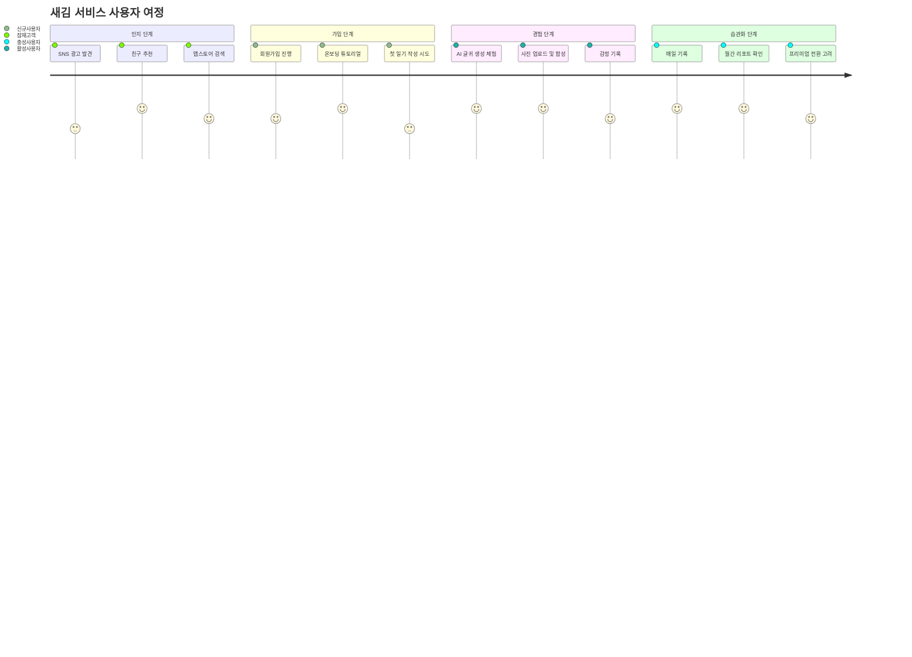
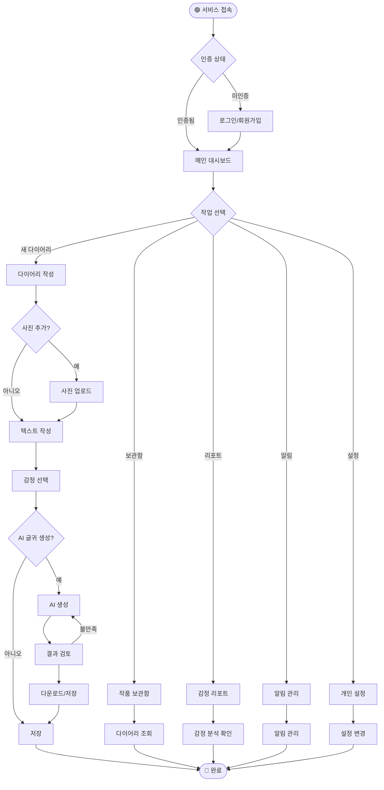
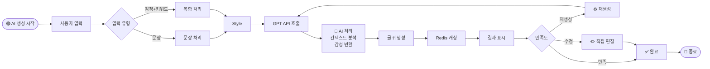

# 감성 AI 다이어리 '새김' - Flow Chart Documentation

---

## 1. 문서 개요

### 문서 목적

본 문서는 '새김' 서비스의 주요 사용자 플로우와 시스템 플로우를 시각적으로 표현하여, 개발팀과 이해관계자들이 서비스 흐름을 명확히 이해할 수 있도록 돕는 플로우차트 문서입니다.

### 문서 정보

- **작성일**: 2025년 8월 11일
- **버전**: 1.0
- **작성자**: 새김꾼들
- **관련 문서**: PRD.md, TRD.md, PERSONA.md

### 다이어그램 범례

- 🟢 시작점
- 🔴 종료점
- 🔷 프로세스
- 🔶 결정 포인트
- 📊 데이터
- 👤 사용자 액션
- 🤖 시스템 처리
- ⚡ 외부 서비스

---

## 2. 전체 서비스 User Journey

### 2.1 사용자 여정 맵

### 2.2 전체 서비스 플로우

---

## 3. 핵심 기능별 상세 플로우

### 3.1 AI 글귀 생성 플로우

---

## Appendix

### A. 플로우차트 기호 설명

| 기호               | 의미          | 설명                        |
| ------------------ | ------------- | --------------------------- |
| `([시작])`         | 시작/종료     | 플로우의 시작점 또는 종료점 |
| `[프로세스]`       | 처리          | 일반적인 처리 단계          |
| `{결정}`           | 분기          | 조건에 따른 분기점          |
| `[(데이터베이스)]` | 저장소        | 데이터 저장소               |
| `[[서브루틴]]`     | 서브 프로세스 | 별도 정의된 프로세스        |

### B. 성능 목표

- 페이지 로드: < 3초
- API 응답: < 200ms
- AI 생성: < 5초
- 이미지 합성: < 3초

### C. 주요 통합 포인트

1. **OpenAI GPT API**: AI 텍스트 생성
2. **MinIO**: 이미지 저장소
3. **PostgreSQL**: 주 데이터베이스
4. **Redis**: 캐싱 및 세션
5. **Next.js**: 프론트엔드
6. **FastAPI**: 백엔드 API
7. **브라우저 Push API**: 웹 푸시 알림
8. **Node.js Cron**: 스케줄링 시스템

---

_본 문서는 '새김' 프로젝트의 플로우차트 문서로, 시스템과 사용자 플로우를 시각적으로 표현합니다._
