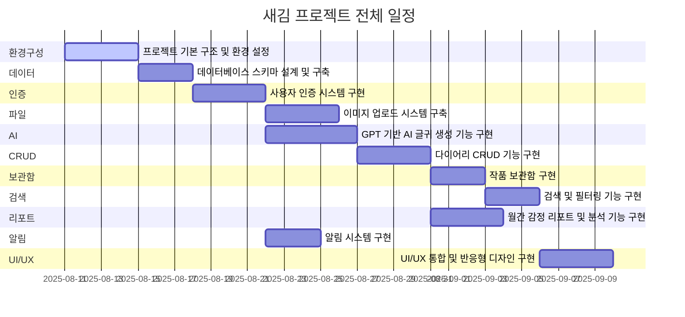
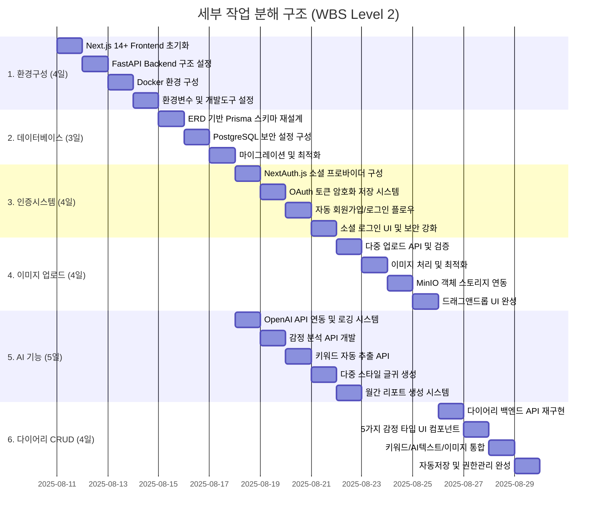
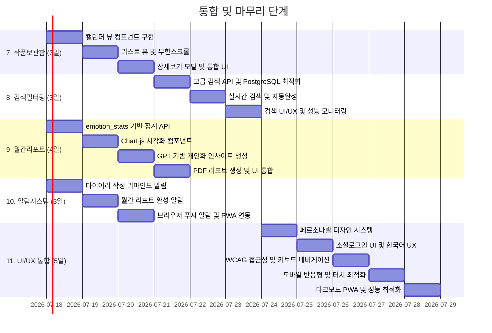
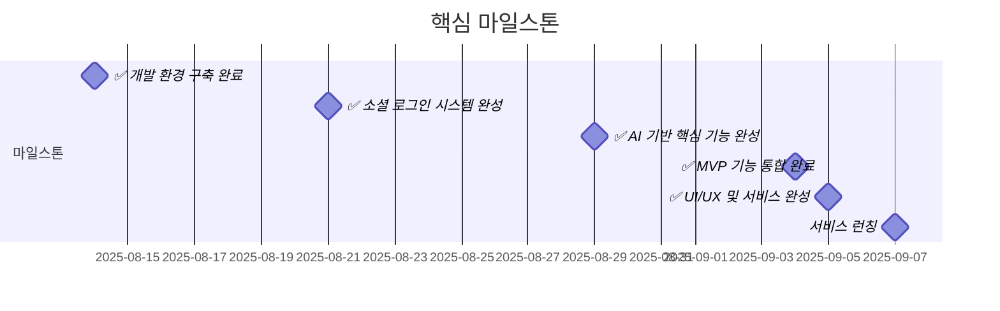
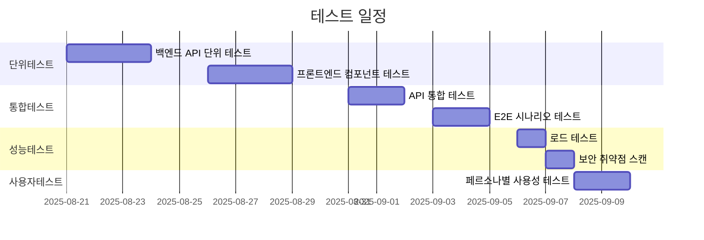
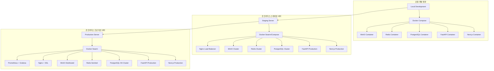

# 감성 AI 다이어리 '새김' - Work Breakdown Structure (WBS)

---

## 1. 문서 개요

### 문서 목적

본 문서는 '새김' 프로젝트의 전체 작업을 체계적으로 분해하고 일정을 시각화한 WBS(Work Breakdown Structure) 문서입니다.

### 문서 정보

- **작성일**: 2025년 8월 10일
- **버전**: 1.0
- **작성자**: 새김꾼들
- **관련 문서**: PRD.md, TRD.md, ERD.md, FLOW_CHART.md, API_SPECS.md, PERSONA.md

---

## 2. 프로젝트 개요

### 2.1 프로젝트 정보

- **프로젝트명**: 감성 AI 다이어리 '새김'
- **기간**: 2025년 8월 11일 ~ 2025년 9월 7일 (28일, 4주)
- **참여인원**: 새김꾼들 개발팀
- **개발 방법론**: Agile/Scrum

### 2.2 기술 스택

- **Frontend**: Next.js 14+, TypeScript, TailwindCSS
- **Backend**: FastAPI, Python 3.11+
- **Database**: PostgreSQL, Redis
- **Storage**: MinIO (S3 Compatible)
- **AI**: OpenAI GPT API
- **Auth**: NextAuth.js v4 (소셜 로그인 전용)
- **Infra**: Docker, Docker Compose

### 2.3 핵심 기능

1. **소셜 로그인 전용 인증** (Google, Kakao, Naver)
2. **AI 기반 감정 분석 및 글귀 생성** (5가지 감정 타입)
3. **다중 이미지 업로드** (최대 10개, 각 15MB)
4. **월간 감정 리포트** (GPT 기반 인사이트)
5. **알림 시스템** (작성 리마인드, 리포트 완성 알림)

---

## 3. WBS 간트 차트

### 3.1 전체 프로젝트 일정



### 3.2 세부 작업 분해 구조



### 3.3 통합 및 마무리 단계



---

## 4. 작업 패키지 상세 정보

### 4.1 WBS 레벨 1 - 주요 작업 패키지

| WBS ID | 작업명                               | 기간 | 시작일     | 종료일     | 의존성        | 복잡도 |
| ------ | ------------------------------------ | ---- | ---------- | ---------- | ------------- | ------ |
| 1.0    | 프로젝트 기본 구조 및 환경 설정      | 4일  | 2025-08-11 | 2025-08-14 | -             | 4/10   |
| 2.0    | 데이터베이스 스키마 설계 및 구축     | 3일  | 2025-08-15 | 2025-08-17 | 1.0           | 6/10   |
| 3.0    | 사용자 인증 시스템 구현              | 4일  | 2025-08-18 | 2025-08-21 | 2.0           | 7/10   |
| 4.0    | 이미지 업로드 시스템 구축            | 4일  | 2025-08-22 | 2025-08-25 | 3.0           | 8/10   |
| 5.0    | GPT 기반 AI 글귀 생성 기능 구현      | 5일  | 2025-08-18 | 2025-08-22 | 3.0           | 7/10   |
| 6.0    | 다이어리 CRUD 기능 구현              | 4일  | 2025-08-26 | 2025-08-29 | 4.0, 5.0      | 6/10   |
| 7.0    | 작품 보관함 구현                     | 3일  | 2025-08-30 | 2025-09-01 | 6.0           | 5/10   |
| 8.0    | 검색 및 필터링 기능 구현             | 3일  | 2025-09-02 | 2025-09-04 | 7.0           | 6/10   |
| 9.0    | 월간 감정 리포트 및 분석 기능 구현   | 4일  | 2025-08-30 | 2025-09-02 | 6.0           | 7/10   |
| 10.0   | 알림 시스템 구현                   | 3일  | 2025-08-22 | 2025-08-24 | 3.0           | 5/10   |
| 11.0   | UI/UX 통합 및 반응형 디자인 구현     | 5일  | 2025-09-05 | 2025-09-09 | 7.0, 8.0, 9.0, 10.0 | 8/10   |
<!-- GDPR 기능은 MVP 이후 개발 예정
| 11.0   | 데이터 삭제 및 GDPR 준수 시스템 구현 | 3일  | 2025-08-30 | 2025-09-01 | 2.0, 3.0, 6.0 | 5/10   |
-->

### 4.2 핵심 마일스톤



---

## 5. 리스크 및 제약사항

### 5.1 주요 리스크

| 리스크                                | 확률 | 영향도 | 완화 방안                                       |
| ------------------------------------- | ---- | ------ | ----------------------------------------------- |
| AI API 요금 초과                      | 중간 | 높음   | Rate Limiting 강화, 캐싱 적용                   |
| 소셜 로그인 API 변경                  | 낮음 | 높음   | NextAuth.js 버전 관리, 대체 프로바이더 준비     |
| GDPR 준수 복잡성                      | 높음 | 높음   | 페르소나별 요구사항 세분화, 법무 검토           |
| 이미지 처리 성능                      | 중간 | 중간   | MinIO 최적화, 내부 CDN 구축 검토                |
| 반응형 디자인 복잡성                  | 중간 | 중간   | 모바일 퍼스트 접근, 점진적 개선                 |
| Docker 컨테이너 오케스트레이션 복잡성 | 중간 | 높음   | Docker Swarm/Compose 단계적 적용, 모니터링 강화 |
| 온프라미스 서버 리소스 부족           | 높음 | 높음   | 리소스 모니터링, 스케일링 전략 수립             |
| 네트워크 보안 및 방화벽 이슈          | 중간 | 중간   | 내부 보안팀 협업, SSL/TLS 인증서 관리           |

### 5.2 제약사항

- **개발 기간**: 32일 내 MVP 완성 필수
- **예산**: OpenAI API 비용 최소화 필요
- **인력**: 제한된 개발 리소스
- **기술**: 검증된 기술 스택만 사용
- **인프라**: 온프라미스 서버 리소스 제약
- **보안**: 내부 네트워크 보안 정책 준수
<!-- MVP 이후 개발 예정
- **규정**: GDPR 완전 준수 필수
-->

---

## 6. 품질 관리 계획

### 6.1 품질 기준

| 항목       | 목표 기준               | 측정 방법       |
| ---------- | ----------------------- | --------------- |
| **성능**   | FCP < 3초               | Lighthouse 측정 |
| **보안**   | HTTPS, 암호화           | 보안 스캔 도구  |
| **접근성** | WCAG 2.1 AA             | axe-core 검증   |
| **호환성** | Chrome, Safari, Firefox | 브라우저 테스트 |
| **모바일** | 반응형 완벽 지원        | 실기기 테스트   |

### 6.2 테스트 계획



---

## 7. 자원 할당 계획

### 7.1 인력 배치

| 역할 | 담당자 | 주요 담당 작업 | 참여 기간 |
| ---- | ------ | ------------ | -------- |
| **회원 기능** | 서민지 | 회원가입, 로그인, 마이페이지 등 회원 관련 기능 | 28일 (100%) |
| **다이어리 작성** | 소효원 | 글(다이어리) 작성 및 수정 | 28일 (100%) |
| **다이어리 목록** | 이수아 | 글(다이어리) 목록 및 조회 | 28일 (100%) |
| **캘린더** | 홍성윤 | 캘린더 뷰 및 날짜별 조회 | 28일 (100%) |
| **알림** | 이성준 | 알림 시스템 및 푸시 알림 | 28일 (100%) |
| **AI/데이터분석** | 전체팀 | GPT API 연동, 감정 분석, 데이터 분석 | - |

### 7.2 기술적 자원

- **개발 환경**: VS Code, Docker Desktop
- **협업 도구**: Git, GitHub, Notion
- **모니터링**: Sentry, Prometheus, Grafana
- **배포 환경**: Docker 컨테이너 기반 온프라미스 서버

---

## 8. 페르소나별 요구사항 매트릭스

### 8.1 3명 페르소나 요구사항

| 기능/페르소나     | 김서연  | 이준호  | 정하늘  |
| ----------------- | ------- | ------- | ------- |
| **소셜 로그인**   | 🟢 필수 | 🟢 필수 | 🟢 필수 |
| **AI 글귀 생성**  | 🟢 높음 | 🟡 중간 | 🟡 중간 |
| **감정 분석**     | 🟡 중간 | 🟢 높음 | 🟢 높음 |
| **이미지 업로드** | 🟢 높음 | 🟡 중간 | 🟡 중간 |
| **월간 리포트**   | 🟡 중간 | 🟢 높음 | 🟢 높음 |
<!-- GDPR 관련 요구사항은 MVP 이후 개발 예정
| **선택적 삭제**   | 🟡 중간 | 🟡 중간 | 🟢 높음 |
| **완전 삭제**     | 🟢 필수 | 🟢 필수 | 🟢 필수 |
-->

### 8.2 감정 타입별 UI 테마

| 감정     | 이모지 | 색상             | 테마명    | 적용 영역                 |
| -------- | ------ | ---------------- | --------- | ------------------------- |
| happy    | 😊     | Gold (#FFD700)   | 행복 테마 | 캘린더, 리포트, 글귀 카드 |
| sad      | 😢     | Blue (#4A90E2)   | 슬픔 테마 | 감정 버튼, 필터링 UI      |
| angry    | 😡     | Red (#E74C3C)    | 화남 테마 | 경고 메시지, 삭제 버튼    |
| peaceful | 😌     | Green (#27AE60)  | 평온 테마 | 성공 메시지, 완료 상태    |
| worried  | 🫨      | Orange (#F39C12) | 불안 테마 | 알림, 주의 메시지         |

---

## 9. 성공 지표 및 KPI

### 9.1 기술적 성과 지표

| 지표                        | 목표값  | 측정 방법       |
| --------------------------- | ------- | --------------- |
| **First Contentful Paint**  | < 3초   | Lighthouse      |
| **Time to Interactive**     | < 5초   | Lighthouse      |
| **Cumulative Layout Shift** | < 0.1   | Core Web Vitals |
| **API Response Time**       | < 200ms | 모니터링 도구   |
| **Error Rate**              | < 0.1%  | Sentry          |
| **Test Coverage**           | > 80%   | Jest/Playwright |

### 9.2 사용자 경험 지표

| 지표                   | 목표값 | 페르소나별 중요도          |
| ---------------------- | ------ | -------------------------- |
| **평균 작성 시간**     | < 3분  | 김서연(높음)               |
| **소셜 로그인 성공률** | > 95%  | 전체 페르소나              |
| **감정 분석 정확도**   | > 75%  | 이준호(높음), 정하늘(높음) |
| **월간 리포트 사용률** | > 60%  | 이준호(높음)               |

---

## 10. 배포 및 운영 계획

### 10.1 배포 환경



### 10.2 모니터링 및 알림

- **성능 모니터링**: Prometheus + Grafana, Core Web Vitals
- **에러 추적**: Sentry (Frontend + Backend)
- **로그 관리**: ELK Stack (Elasticsearch + Logstash + Kibana)
- **컨테이너 모니터링**: cAdvisor, Docker Logs
- **인프라 모니터링**: Node Exporter, Blackbox Exporter
- **알림 시스템**: AlertManager + Slack 연동, 이메일 알림
- **백업 시스템**: 자동 PostgreSQL/MinIO 백업, 정기 스냅샷

---

## 11. 결론 및 다음 단계

### 11.1 프로젝트 완료 조건

1. ✅ **모든 11개 주요 태스크 완료** (55개 서브태스크 포함)
2. ✅ **5명 페르소나별 요구사항 완전 충족**
3. ✅ **GDPR Article 17 완전 준수**
4. ✅ **성능 기준 달성** (FCP < 3초, 접근성 WCAG 2.1 AA)
5. ✅ **보안 기준 충족** (HTTPS, 암호화, Rate Limiting)

### 11.2 Post-MVP 로드맵

| 단계     | 기간   | 주요 기능                                    |
| -------- | ------ | -------------------------------------------- |
| **M2-3** | +2개월 | P1 기능 (임시저장, 스타일 설정, 이미지 합성) |
| **M4-6** | +3개월 | P2 기능 (SNS 공유, 태그, 커뮤니티)           |
| **M7+**  | +6개월 | 프리미엄 모델, B2B 확장                      |

### 11.3 성공을 위한 핵심 요소

1. **페르소나 중심 개발**: 5명 페르소나 요구사항 완벽 이행
2. **AI 최적화**: GPT API 비용 효율성과 품질의 균형
3. **보안 우선**: 소셜 로그인과 GDPR 준수의 완벽한 구현
4. **성능 최적화**: 모바일 퍼스트 반응형 디자인
5. **한국형 UX**: 한국 사용자를 위한 맞춤형 사용자 경험

---

## Appendix

### A. 문서 참조 매트릭스

| WBS 작업         | PRD | TRD | ERD | FLOW | API | PERSONA |
| ---------------- | --- | --- | --- | ---- | --- | ------- |
| 1.0 환경구성     | ✅  | ✅  | -   | -    | -   | -       |
| 2.0 데이터베이스 | ✅  | ✅  | ✅  | -    | -   | ✅      |
| 3.0 인증시스템   | ✅  | ✅  | ✅  | ✅   | ✅  | ✅      |
| 4.0 이미지업로드 | ✅  | ✅  | ✅  | -    | ✅  | ✅      |
| 5.0 AI기능       | ✅  | ✅  | ✅  | ✅   | ✅  | ✅      |
| 6.0 다이어리CRUD | ✅  | ✅  | ✅  | ✅   | ✅  | ✅      |
| 7.0 작품보관함   | ✅  | ✅  | -   | ✅   | ✅  | ✅      |
| 8.0 검색필터링   | ✅  | ✅  | ✅  | ✅   | ✅  | ✅      |
| 9.0 월간리포트   | ✅  | ✅  | ✅  | ✅   | ✅  | ✅      |
| 10.0 UI/UX통합   | ✅  | ✅  | -   | ✅   | -   | ✅      |
| 11.0 GDPR준수    | ✅  | ✅  | ✅  | ✅   | ✅  | ✅      |

### B. 기술 스택 상세 버전

```yaml
frontend:
  framework: 'Next.js 14.2.0+'
  language: 'TypeScript 5.0+'
  styling: 'TailwindCSS 3.4+'
  ui: 'Headless UI, Radix UI'
  auth: 'NextAuth.js 4.24+'
  forms: 'React Hook Form'
  validation: 'Zod'

backend:
  framework: 'FastAPI 0.104+'
  language: 'Python 3.11+'
  orm: 'SQLAlchemy 2.0+'
  validation: 'Pydantic v2'
  async: 'asyncio, aiohttp'

database:
  primary: 'PostgreSQL 15+'
  cache: 'Redis 7.0+'
  storage: 'MinIO (S3 Compatible)'

ai_services:
  text: 'OpenAI GPT-4 API'
  embeddings: 'OpenAI text-embedding-3-small'

infrastructure:
  containerization: 'Docker, Docker Compose'
  deployment: 'Docker Swarm/Compose 온프라미스'
  monitoring: 'Prometheus, Grafana, ELK Stack, Sentry'
```

---

_본 문서는 '새김' 프로젝트의 공식 작업 분해 구조 문서로, 개발 진행에 따라 지속적으로 업데이트됩니다._
